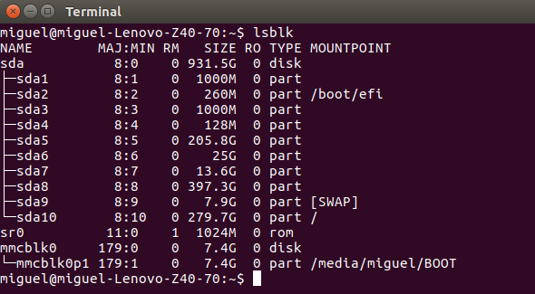
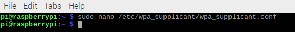
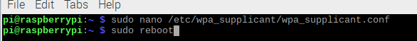
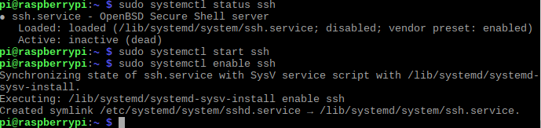
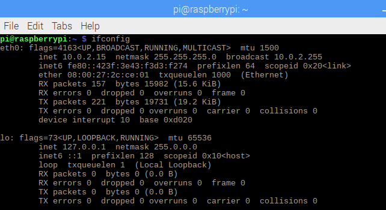
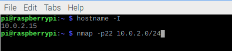
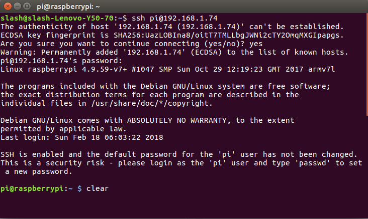
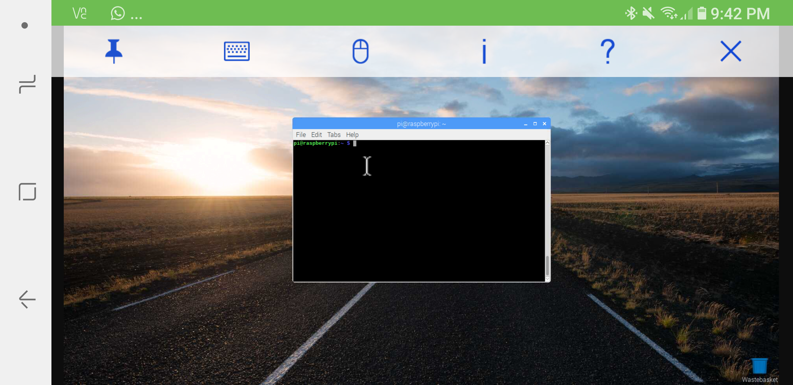
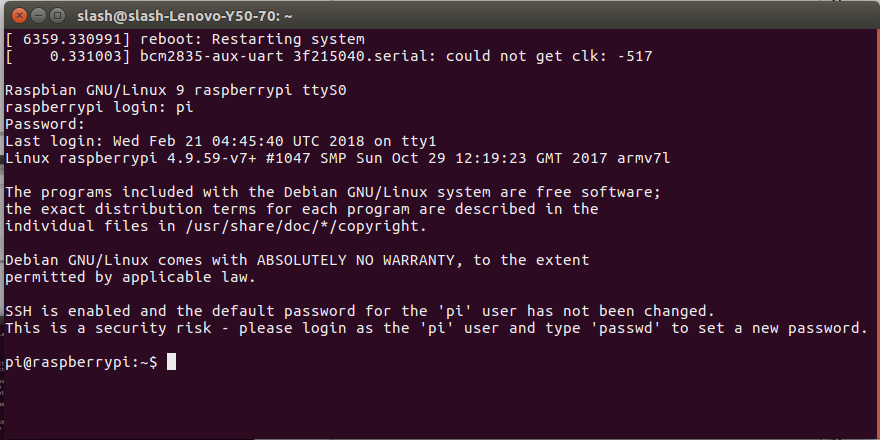

# Practica 1
## Sistemas Ebebidos
### Nombres de los alumnos:
#### 1) Lopez Hernandez Marcos Miguel
#### 2) Torres Alvarado Miguel Angel

1) Lo primero con lo que empezamos fue cargar un sistema operativo, para lo cual para lo cual primero teníamos que verificar el nombre del microSD que íbamos a utilizar.

De esta manera nos muestra el nombre del microSD y sus particiones las cuales son las que vamos a utilizar para desmontarla, después agregar una copia de la imagen del sistema operativo y hacer que la memoria sea de arranque.

2) Empezamos a Utilizar el RaspberryPi3 como una computadora.

3) Configuramos la interfaz de red inalámbrica
 Para esto habríamos la terminal del Raspberryp3 y configuramos el router de esta manera.

Agregamos la configuración de red

Después de esto solo tenemos que reiniciar nuestro sistema operativo de esta forma

4) Usaremos RaspberryPi3 junto con un protocolo de res (SSH),
el cual ayuda a intercambiar datos sobre un canal seguro, para verificar el estado del servicio SSH es Imagenpor eso que debemos de ponerlo activo el cual lo generaremos junImagento con estos 3 comandos para poder iniciarlo y habilitarlo.

Verificamos el nombre de la interfaz con el comando:

Determinamos la dirección IP y le hacemos una ejecución con nmap el cual realiza un broadcast el cual realiza un escaneo en el puerto 22.

Con la ip anterior ingresamos el comando
>ssh 192.168.1.74
ingresamos las credenciales: Usuario: pi Contraseña: Raspberry y esperamos que la conexión se establezca hasta que nos aparezca como en la siguiente imagen:

5 Usando la RaspberryPi3 mediante VNC.

Una vez que habilitamos el servicio de VNC en la Raspberry, desde nuestro smartphone descargamos la aplicación Real VNC, desde la cual ingresaremos proporcionando la ip de nuestra raspberry y las credenciales para el usuario pi. Una vez hecho esto, podremos manejar desde nuestro smartphone la raspberry como se muestra en la siguiente imagen:

6 Conexión mediante UART

Des pués de realizar las configuraciones en la raspberry para aceptar conexiones mediante UART; utilizando jumpers hembra-hembra conectamos nuestro módulo ft232 a nuestra raspberry en los pines que se detallan en la práctica, una vez hecho esto procedemos a nuestra compu con ubuntu a realizar las configuraciones para identificar el módulo ft232. A continuación en nuestra terminal escribimos el comando 

>screen ttyUSB0 

Y esperamos a que nos pida reiniciar la raspberry, lo cual realizaremos ingresando dentro de la terminal de esta el comando

>reboot

Esperamos a que identifique la raspberry y nuestra terminal en la PC debe mostrar la siguiente imagen

