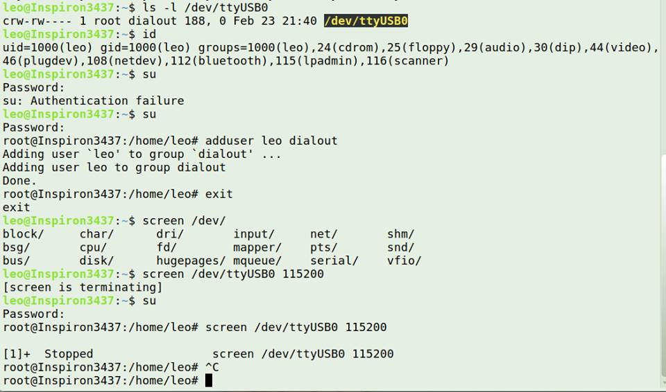

# Reporte práctica 1 : Configuración de la raspberry

## Integrantes del equipo 5

    1. Coxtinica Reyes Marco Antonio

    2. Morales Zepeda Victor Rene

    3. Pérez Bravo Mauro Leonardo

### Imagenes de conexión SSH

 

 

### Imagenes de conexión VNC

  

  

  

### Imágenes de conexión UART

  

  

